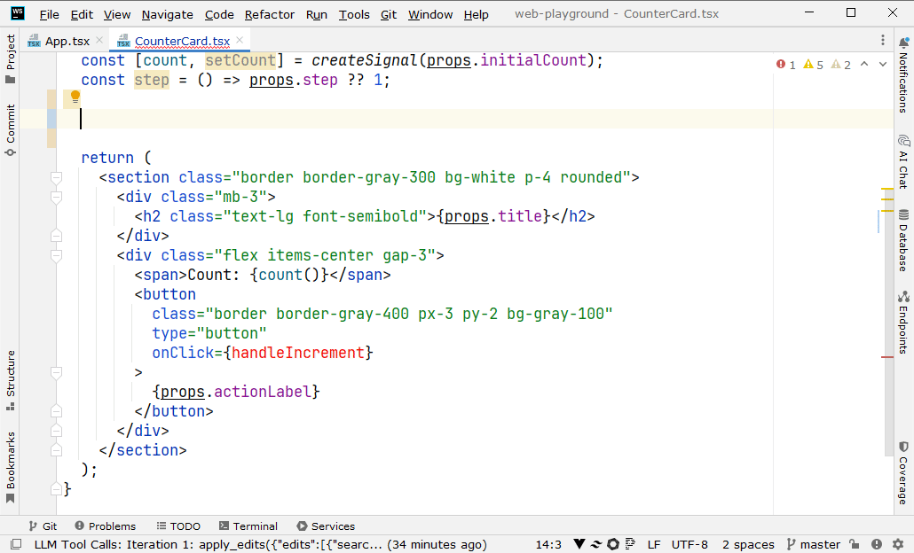

  
  
  # Magic Code Completion
  
  JetBrains IDEs plugin for AI-assisted code completion using OpenAI-compatible APIs with agentic file reading and multi-edit capabilities.
  
  

## How to Use

### Initial Setup

1. Open **Tools → Magic Code Completion** in your IDE
2. Configure API access to your LLM (we recommend using advanced reasoning models for better code quality)
3. Specify glob patterns for files you want the LLM to see - during completion generation, the LLM will see the list of these files and can read them if needed to expand context

### Using the Plugin

1. Place your cursor at the location where you want code completion
2. Press **Alt+I**
3. The plugin sends your current file (with cursor position) and file tree to the LLM
4. The LLM either requests additional file contents or generates code completion immediately
5. Changes are applied automatically
